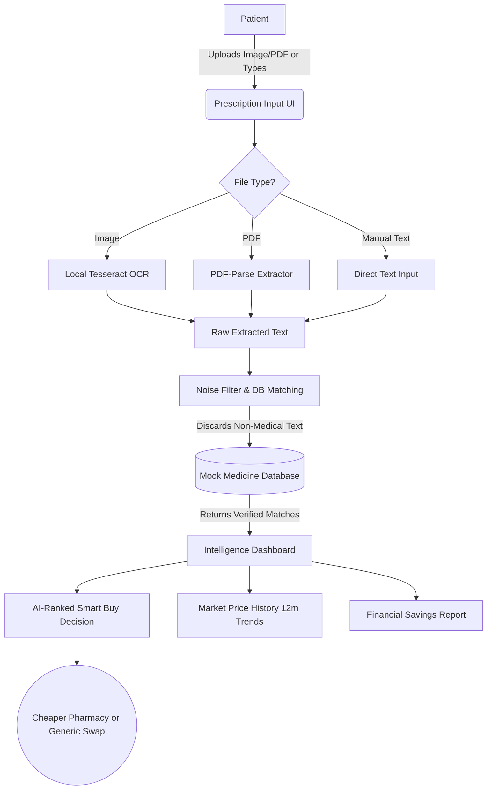

# 💊 RxRadar: Agentic Prescription Price Intelligence

**RxRadar** is an intelligent, privacy-first prescription analytics platform designed to solve healthcare affordability and lack of price transparency. It transforms static prescriptions into actionable, data-driven purchasing decisions.

By uploading a photo or PDF of a prescription, RxRadar processes the document entirely offline using local OCR to ensure maximum medical data privacy. It aggressively filters out document noise, maps the prescribed medications against a comprehensive market database, and empowers patients to navigate the fragmented pharmaceutical market to secure the best possible prices.

---

## ✨ Key Features

- **Privacy-First Local OCR**: Process images and PDFs locally using Tesseract.js and pdf-parse. No medical data leaves your machine.
- **Smart Buy Decision Engine**: AI-ranked recommendations based on price variance, generic availability, and therapeutic equivalence (matching exact salt compositions).
- **Market Price History**: Interactive 12-month trend charts allowing users to track drug pricing fluctuations across various pharmacies.
- **Actionable Savings Reports**: Detailed financial breakdown projecting monthly and annual savings, including one-click "Pharmacist Scripts" to safely request generic substitutions.
- **Intelligent Noise Filtering**: Automatically discards OCR artifacts (doctor names, clinic addresses) and only outputs verified medicines matched against the database.

---

## 🛠️ Technology Stack

**Frontend:**
- React 18, TypeScript, Vite
- Tailwind CSS (Premium Styling & UI)
- Motion / Framer Motion (Animations)
- React Router DOM
- Lucide React (Icons)

**Backend:**
- Node.js, Express.js
- Tesseract.js (Optical Character Recognition)
- pdf-parse (PDF Text Extraction)
- Multer (File Handling)

---

## 🌊 Architecture & Workflow

Below is the workflow demonstrating how a physical prescription is transformed into an actionable Smart Buy Plan.



---

## 🚀 Getting Started

Follow these steps to run RxRadar locally on your machine.

### 1. Clone the repository
```bash
git clone https://github.com/somsu123/RxRader.git
cd RxRader
```

### 2. Setup the Backend
Open a terminal and run the following:
```bash
cd backend
npm install
npm run dev
```
*The backend will start running on `http://localhost:5000`.*

### 3. Setup the Frontend
Open a new terminal window and run the following:
```bash
cd frontend
npm install
npm run dev
```
*The frontend will start running on `http://localhost:5173`.*

---

## 💡 Usage

1. Open your browser to the local Vite URL.
2. On the **Intelligence Dashboard**, upload a sample prescription image, PDF, or type a list of medicines (e.g., `Augmentin 625mg`, `Lipitor 10mg`).
3. Click **Analyze**. The system will filter the data and show you the verified medicines.
4. Click **Analyze Medicines** to be taken to your dashboard.
5. View the **Smart Buy Decision** to see exact pharmacist scripts and ranked alternatives.
6. Navigate to the **Price History** tab to view 12-month market trends.
7. Navigate to the **Savings Reports** tab to view your complete ROI breakdown.

---

*Built for a more transparent healthcare future.*
